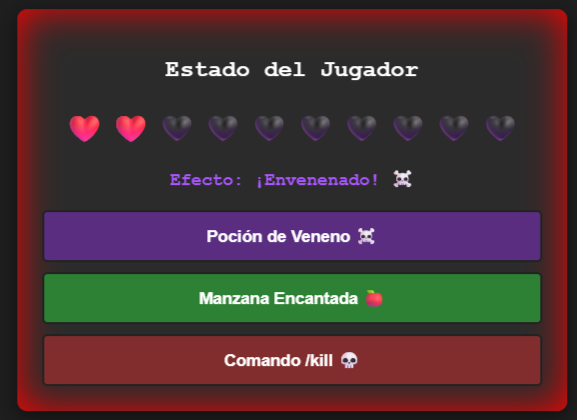
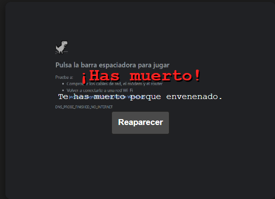

# 🧩 Componente Visual Interactivo: Minecraft Health Bar

**Autor:** Félix Eliel Olivera Jiménez  
**Carrera:** Ingeniería en Sistemas Computacionales  
**Institución:** Tecnológico Nacional de México Campus Oaxaca  

---

## 🎯 ¿Qué problema resuelve?
El desarrollo de interfaces web interactivas a menudo requiere programar elementos visuales dinámicos desde cero (como barras de vida, efectos de daño, pantallas de estado o animaciones personalizadas) en cada vista, lo que genera código repetitivo. Este componente resuelve dicho problema al proporcionar una interfaz visual reutilizable, modular y escrita en JavaScript puro. Encapsula tanto su estructura como sus estilos CSS y recursos gráficos, permitiendo integrarlo en cualquier página web sin necesidad de frameworks pesados como React o Vue.

---

## 📦 Instalación

Para utilizar este componente visual en tu proyecto, asegúrate de tener la siguiente estructura de carpetas:

```text
├── /css
│   └── componente.css
├── /js
│   └── componente.js
└── /img
    └── death.png (opcional, ya que aqui puedes poner tu imagen de preferencia)
Luego, incluye la hoja de estilos en la etiqueta <head> y el archivo JavaScript antes de cerrar el <body> de tu documento HTML:

HTML
<!-- En el head de tu HTML -->
<link rel="stylesheet" href="css/componente.css">

<!-- Antes de cerrar el body -->
<script src="js/componente.js"></script>
💻 Uso y Ejemplos de Código
Una vez importados los archivos, puedes instanciar e inicializar el componente visual pasándole un contenedor HTML y la ruta de tu imagen de preferencia:

1. Preparar el contenedor HTML
HTML
<div id="contenedor-prueba"></div>
2. Inicializar el componente mediante JavaScript
JavaScript
<script>
  // Instancia reutilizable del componente visual
  const barraSalud = new MinecraftHealthBar('contenedor-prueba', 'img/imagendepreferencia.png');
</script>
📸 Capturas de Pantalla

**Componente Visual en Estado Normal / Interactivo:**




🎥 Video Promocional
Haz clic en la imagen para ver la demostración en video del componente en acción:
[](https://youtu.be/3ZFottIS0Mo)